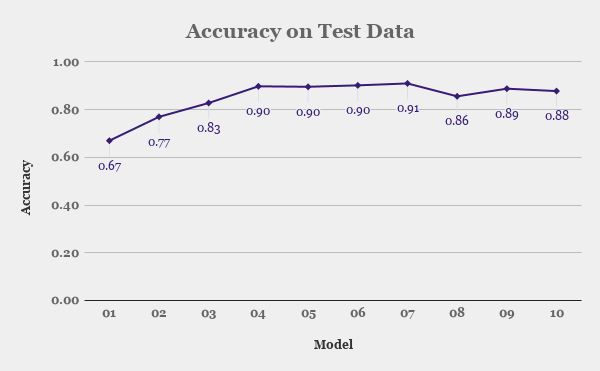
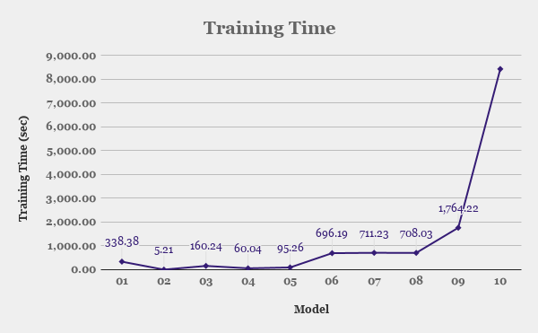

## Compare the performance of different text classification algorithms - Keras on Tensorflow
An attempt is made to evaluate the classification accuracy of various text classification algorithms, using the TREC data set. 

### The following algorithms are selected for the purpose. The implementation uses Scikit and Keras (with Tensorflow as backend).

1. Logistic Regression (`01_sentence_classifier_lr.py`)
2. Naive Bayes (`02_sentence_classifier_nb`)
3. SVM (Support Vector Machines) (`03_sentence_classifier_svm`)
4. 2D CNN(from [*Yoon Kim*](https://github.com/suriak/sentence-classification-cnn)) with **static** pre-trained Embedding Layer([*GloVe*](https://nlp.stanford.edu/data/glove.6B.zip)) (`04_sentence_classifier_cnn2d_glove_nontrainable`)
5. 2D CNN(from [*Yoon Kim*](https://github.com/suriak/sentence-classification-cnn)) with **non-static** pre-trained Embedding Layer([*GloVe*](https://nlp.stanford.edu/data/glove.6B.zip)) (`05_sentence_classifier_cnn2d_glove_trainable`)
6. LSTM with **static** pre-trained Embedding Layer([*GloVe*](https://nlp.stanford.edu/data/glove.6B.zip))(`06_sentence_classifier_lstm_glove_nontrainable`)
7. LSTM with **non-static** pre-trained Embedding Layer([*GloVe*](https://nlp.stanford.edu/data/glove.6B.zip))(`07_sentence_classifier_lstm_glove_trainable`)
8. LSTM with Embedding Layer from scratch (`08_sentence_classifier_lstm_from_scratch`)
9. Stacked LSTM with **non-static** pre-trained Embedding Layer([*GloVe*](https://nlp.stanford.edu/data/glove.6B.zip)) (`09_sentence_classifier_lstm_stacked_glove_trainable`)
10. 1D CNN with pre-trained Embedding Layer([*ELMo*](https://arxiv.org/abs/1802.05365))(`10_sentence_classifier_cnn1d_elmo`)

The **models are evaluated by comparing the accuracy on test data set (TREC_10.label) provided by TREC**. To make the comparison fair and to reduce the influence of randomness, the experiment is repeated five times (for each model) and the final accuracy is obtained from the mean of the five observations. All models are trained and evaluated on CPU machine.
* The models share almost same hyper parameters like number of epochs, optimizer(adam) wherever possible.

## Performance

| Model       | Accuracy   |Training Time (in sec)|
|-------------|------------|----------------------|
|   01        | 0.67       | 335.69               |
|   02        | 0.77       | **5.21**             |
|   03        | 0.83       | 160.24               |
|   04        | 0.90       | 60.04                |
|   05        | 0.90       | 95.26                |
|   06        | 0.90       | 696.19               |
|   07        | **0.91**   | 711.23               |
|   08        | 0.86       | 708.03               |
|   09        | 0.89       | 1,764.22             |
|   10        | 0.88       | 8,436.60             |

The plots below show the performance and training time of the selected algorithms.

## Observations

* The classical algorithms (like lr, nb and svm) perform best to their capability, given the fact that no fine tuning and feature engineering is performed on the data set.
* CNN delivers almost the same accuracy as that of LSTM at a reduced training times. This vindicates the fact that, CNN are best at finding patterns in the data set.
* Memory models like LSTM gave the best performance at the cost of increased training time.
* Comparing models `07` and `08`, there is evident increase in performance when a pre-trained embedding layer is used. Hence, transfer learning makes sense in the case of NLP with pre-trained word vectors.
* Model `10`(ELMo) performed slightly lower when compared to models with word vectors (model `04`, `05`, `06`, `07` & `09`). This needs to be investigated.
* The performance improvement given by complex models like (stacked lstm[`09`]) is less significant when the training time and computation power it takes is considered.

### Acknowledgments:
1. [Jordan Hart](https://github.com/JHart96/keras_elmo_embedding_layer) - The drop in ELMo embedding layer is obtained from his work.
2. Denny Britz - https://github.com/dennybritz/cnn-text-classification-tf
3. Jason Brownlee - https://machinelearningmastery.com/use-word-embedding-layers-deep-learning-keras/

### Foot Notes:
1. **GloVe embedding file is available [here](https://nlp.stanford.edu/data/glove.6B.zip) and should be kept inside `embeddings` folder.**
2. A validation split is not used and is intentional, since the aim here is to compare the performance on the models and not to identify the hyper parameters for the best performing model.
3. Linear Regression, Naive Bayes and SVM are implemented using SciKit Learn.

## Appendix A - Accuracy of the five runs

| Model       | Run1   | Run2   | Run3   | Run4   | Run5   | Avg    |
|-------------|--------|--------|--------|--------|--------|--------|
|   **01**    | 0.67   | 0.67   | 0.67   | 0.67   | 0.67   |**0.67**|
|   **02**    | 0.77   | 0.77   | 0.77   | 0.77   | 0.77   |**0.77**|
|   **03**    | 0.83   | 0.82   | 0.83   | 0.83   | 0.83   |**0.83**|
|   **04**    | 0.9    | 0.91   | 0.9    | 0.87   | 0.91   |**0.90**|
|   **05**    | 0.89   | 0.91   | 0.9    | 0.9    | 0.88   |**0.90**|
|   **06**    | 0.89   | 0.9    | 0.91   | 0.9    | 0.91   |**0.90**|
|   **07**    | 0.91   | 0.91   | 0.92   | 0.9    | 0.91   |**0.91**|
|   **08**    | 0.87   | 0.85   | 0.86   | 0.85   | 0.85   |**0.86**|
|   **09**    | 0.91   | 0.79   | 0.93   | 0.9    | 0.91   |**0.89**|
|   **10**    | 0.88   | 0.88   | 0.88   | 0.87   | 0.88   |**0.88**|

## Appendix B - Training time (in sec) of the five runs

| Model       | Run1   | Run2   | Run3   | Run4   | Run5   | Avg      |
|-------------|--------|--------|--------|--------|--------|----------|
|   **01**    | 335.7  | 336.01 | 335.69 | 336.32 | 348.18 |**338.38**|
|   **02**    | 5.22   | 5.23   | 5.2    | 5.22   | 5.2    | **5.21** |
|   **03**    | 156.15 | 159.12 | 159.8  | 160.5  | 165.61 |**160.24**|
|   **04**    | 63.5   | 59.07  | 57.97  | 58.78  | 60.88  | **60.04**|
|   **05**    | 94.91  | 94.76  | 94.48  | 99.59  | 92.58  | **95.26**|
|   **06**    | 702.59 | 735.93 | 698.32 | 670.03 | 674.08 |**696.19**|
|   **07**    | 707.77 | 694.36 | 728.46 | 709.89 | 715.65 |**711.23**|
|   **08**    | 714.83 | 709.81 | 693.41 | 698.33 | 723.75 |**708.03**|
|   **09**    | 1827.92| 1790.95| 1753.33| 1790.14| 1658.77|**1,764.22**|
|   **10**    | 8501.82| 8229.47| 8575.21| 8650.87| 8225.62|**8,436.60**|
